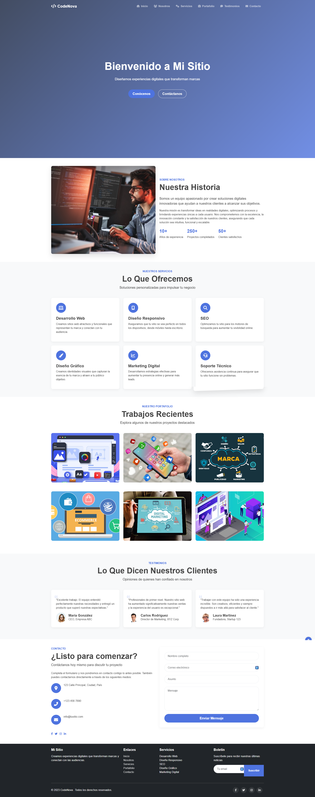

# CodeNova - Sitio Web Corporativo

 

## Descripción

CodeNova es un sitio web corporativo moderno y responsivo diseñado para mostrar servicios de desarrollo web, diseño y marketing digital. El sitio utiliza un diseño de una sola página (one-page) con múltiples secciones y efectos visuales atractivos.

## Características

- **Diseño Responsivo**: Se adapta perfectamente a todos los tamaños de pantalla
- **Animaciones al Scroll**: Elementos que aparecen con efectos al hacer scroll
- **Video de YouTube como Fondo**: Sección hero con video de fondo
- **Navegación Suave**: Desplazamiento suave entre secciones
- **Efectos de Hover**: Transiciones elegantes al pasar el cursor
- **Formulario de Contacto**: Con validación de campos
- **Portafolio Interactivo**: Muestra de proyectos con efectos de hover
- **Sección de Testimonios**: Opiniones de clientes
- **Botón de Volver Arriba**: Para facilitar la navegación
- **Preloader**: Animación de carga inicial
- **Modo Oscuro/Claro**: Selector de tema (opcional)

## Tecnologías Utilizadas

- **HTML5**: Estructura semántica
- **CSS3**: Estilos y animaciones
- **JavaScript**: Interactividad y efectos
- **Bootstrap 5**: Framework CSS para diseño responsivo
- **Font Awesome 6**: Iconos vectoriales
- **AOS (Animate On Scroll)**: Biblioteca para animaciones al hacer scroll
- **YouTube API**: Para el video de fondo

## Estructura del Proyecto

```
proyecto/
├── index.html          # Archivo HTML principal
├── css/
│   └── style.css       # Estilos personalizados
├── script.js           # JavaScript personalizado
├── img/                # Carpeta de imágenes
│   ├── web1.jpg
│   ├── web2.png
│   └── ...
└── README.md           # Este archivo
```

## Instalación y Uso

1. **Clonar el repositorio**:
   ```bash
   git clone https://github.com/tu-usuario/codenova.git
   cd codenova
   ```

2. **Abrir el proyecto**:
   - Abre el archivo `index.html` en tu navegador para ver el sitio.
   - O utiliza un servidor local como Live Server de VS Code.

3. **Personalización**:
   - Reemplaza las imágenes en la carpeta `img/` con tus propias imágenes.
   - Modifica los textos en `index.html` según tus necesidades.
   - Ajusta los colores y estilos en `css/style.css`.
   - Cambia el ID del video de YouTube en `script.js`.

## Personalización del Video de Fondo

Para cambiar el video de fondo de YouTube:

1. Encuentra el ID del video de YouTube que deseas usar (la parte después de `v=` en la URL).
2. Abre el archivo `script.js`.
3. Busca las líneas que contienen `videoId` y `playlist`.
4. Reemplaza el ID actual con tu nuevo ID en ambas líneas.

## Optimización de Imágenes

Para un mejor rendimiento, se recomienda optimizar las imágenes:

- **Imágenes de portafolio**: 800px × 600px, formato JPG o WebP
- **Imágenes de testimonios**: 150px × 150px, formato JPG o PNG
- **Imagen de "Sobre Nosotros"**: 800px × 600px, formato JPG o WebP

## Contribución

Si deseas contribuir a este proyecto:

1. Haz un fork del repositorio
2. Crea una rama para tu característica (`git checkout -b feature/nueva-caracteristica`)
3. Haz commit de tus cambios (`git commit -m 'Añadir nueva característica'`)
4. Haz push a la rama (`git push origin feature/nueva-caracteristica`)
5. Abre un Pull Request

## Licencia

Este proyecto está bajo la Licencia MIT. Ver el archivo `LICENSE` para más detalles.

## Contacto

Tu Nombre - [tu-email@ejemplo.com](mailto:tu-email@ejemplo.com)

Enlace del proyecto: [https://github.com/tu-usuario/codenova](https://github.com/tu-usuario/codenova)
vo

 

## Descripción

CodeNova es un sitio web corporativo moderno y responsivo diseñado para mostrar servicios de desarrollo web, diseño y marketing digital. El sitio utiliza un diseño de una sola página (one-page) con múltiples secciones y efectos visuales atractivos.

## Características

- **Diseño Responsivo**: Se adapta perfectamente a todos los tamaños de pantalla
- **Animaciones al Scroll**: Elementos que aparecen con efectos al hacer scroll
- **Video de YouTube como Fondo**: Sección hero con video de fondo
- **Navegación Suave**: Desplazamiento suave entre secciones
- **Efectos de Hover**: Transiciones elegantes al pasar el cursor
- **Formulario de Contacto**: Con validación de campos
- **Portafolio Interactivo**: Muestra de proyectos con efectos de hover
- **Sección de Testimonios**: Opiniones de clientes
- **Botón de Volver Arriba**: Para facilitar la navegación
- **Preloader**: Animación de carga inicial
- **Modo Oscuro/Claro**: Selector de tema (opcional)

## Tecnologías Utilizadas

- **HTML5**: Estructura semántica
- **CSS3**: Estilos y animaciones
- **JavaScript**: Interactividad y efectos
- **Bootstrap 5**: Framework CSS para diseño responsivo
- **Font Awesome 6**: Iconos vectoriales
- **AOS (Animate On Scroll)**: Biblioteca para animaciones al hacer scroll
- **YouTube API**: Para el video de fondo

## Estructura del Proyecto

```
proyecto/
├── index.html          # Archivo HTML principal
├── css/
│   └── style.css       # Estilos personalizados
├── script.js           # JavaScript personalizado
├── img/                # Carpeta de imágenes
│   ├── web1.jpg
│   ├── web2.png
│   └── ...
└── README.md           # Este archivo
```

## Instalación y Uso

1. **Clonar el repositorio**:
   ```bash
   git clone https://github.com/tu-usuario/codenova.git
   cd codenova
   ```

2. **Abrir el proyecto**:
   - Abre el archivo `index.html` en tu navegador para ver el sitio.
   - O utiliza un servidor local como Live Server de VS Code.

3. **Personalización**:
   - Reemplaza las imágenes en la carpeta `img/` con tus propias imágenes.
   - Modifica los textos en `index.html` según tus necesidades.
   - Ajusta los colores y estilos en `css/style.css`.
   - Cambia el ID del video de YouTube en `script.js`.

## Personalización del Video de Fondo

Para cambiar el video de fondo de YouTube:

1. Encuentra el ID del video de YouTube que deseas usar (la parte después de `v=` en la URL).
2. Abre el archivo `script.js`.
3. Busca las líneas que contienen `videoId` y `playlist`.
4. Reemplaza el ID actual con tu nuevo ID en ambas líneas.

## Optimización de Imágenes

Para un mejor rendimiento, se recomienda optimizar las imágenes:

- **Imágenes de portafolio**: 800px × 600px, formato JPG o WebP
- **Imágenes de testimonios**: 150px × 150px, formato JPG o PNG
- **Imagen de "Sobre Nosotros"**: 800px × 600px, formato JPG o WebP

## Contribución

Si deseas contribuir a este proyecto:

1. Haz un fork del repositorio
2. Crea una rama para tu característica (`git checkout -b feature/nueva-caracteristica`)
3. Haz commit de tus cambios (`git commit -m 'Añadir nueva característica'`)
4. Haz push a la rama (`git push origin feature/nueva-caracteristica`)
5. Abre un Pull Request

## Licencia

Este proyecto está bajo la Licencia MIT. Ver el archivo `LICENSE` para más detalles.

## Contacto

Tu Nombre - bioshock7w7@gmail.com

Enlace del proyecto: [https://github.com/tu-usuario/codenova](https://github.com/tu-usuario/codenova)
